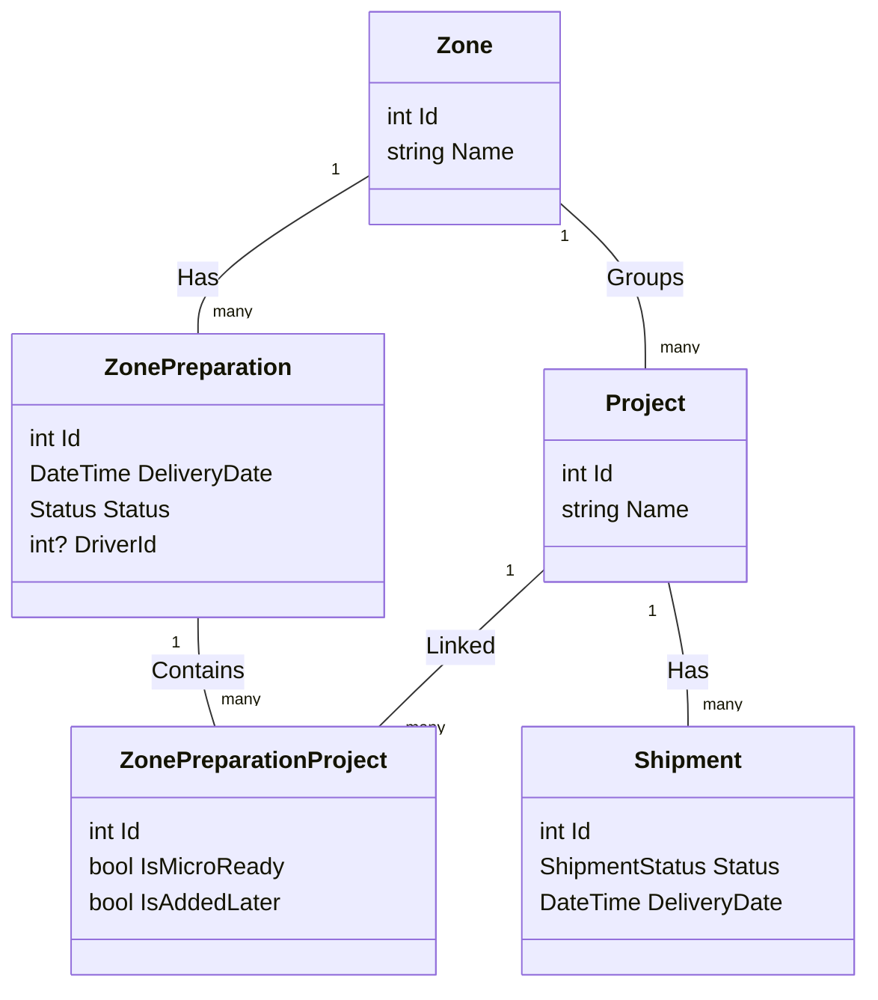

# Depo Yönetimi (Warehouse Management) Dökümantasyonu

Bu döküman, Akyıldız Sevkiyat Sistemi içerisindeki Depo Yönetimi modülünün çalışma mantığını, veri yapılarını ve iş akışlarını detaylandırmaktadır.

## 1. Genel Bakış

Depo Yönetimi modülü, sevkiyatı planlanmış siparişlerin hazırlanma (toplama) ve araca yüklenme süreçlerini yönetir. Sistem, **Bölge (Zone)** ve **Proje (Project)** bazlı bir yapı üzerine kuruludur.

İki temel toplama (picking) aşaması vardır:
1.  **Micro Picking (Proje Bazlı):** Belirli bir müşteri (Proje) için detaylı ürünlerin (adetli, küçük ürünler) toplanması.
2.  **Macro Picking (Bölge Bazlı):** Tüm bir sevkiyat rotası (Bölge) için geçerli olan toplu ürünlerin (koli, palet vb.) toplanması.

## 2. Temel Kavramlar

### Entity'ler

*   **Zone (Bölge):** Coğrafi veya lojistik bir dağıtım rotasıdır (örn: "İstanbul Anadolu", "Ankara Tır").
*   **Project (Proje):** Sevkiyatın yapılacağı nokta veya müşteri (örn: "Migros Ataşehir", "Şantiye X").
*   **ZonePreparation (Bölge Hazırlığı):** Belirli bir tarihte, belirli bir bölgeye yapılacak sevkiyatların genel hazırlık durumunu tutan ana kayıttır.
*   **ZonePreparationProject:** Bir bölge hazırlığı içindeki belirli bir projenin durumunu takip eder.
*   **PickingType (Toplama Türü):** Bir ürünün nasıl toplanacağını belirtir:
    *   `Micro`: Müşteri bazında tek tek toplanır.
    *   `Macro`: Rota bazında topluca toplanır.

### Durumlar (Statuses)

**ZonePreparationStatus (Hazırlık Durumu):**
1.  **Draft:** Hazırlık başladı.
2.  **MicroPicking:** Micro toplama işlemleri devam ediyor.
3.  **MicroReady:** Tüm projelerin Micro toplaması bitti.
4.  **MacroPicking:** (Sistemsel olarak MicroReady ile MacroReady arası geçiş)
5.  **MacroReady / ReadyForDriverInfo:** Macro toplama da bitti, sevkiyat yüklemeye hazır. Sürücü bekleniyor.
6.  **ReadyForTransfer:** Sürücü ve araç atandı, transfer edilebilir.

**ShipmentStatus (Sipariş Durumu) Eşleşmesi:**
*   Depo süreci, siparişler `AssignedToWarehouse` (Depoya Atandı) durumuna gelince başlar.
*   Hazırlık ilerledikçe sipariş durumları otomatik güncellenir:
    *   `MicroReady` -> `Picking` (Toplanıyor)
    *   `MacroReady` -> `ReadyForDispatch` (Sevkiyata Hazır)
    *   `DriverAssigned` -> `AssignedToVehicle` (Araca Atandı)

## 3. İş Akışı ve Mantık

### Adım 1: Dashboard ve Hazırlık Başlatma
Kullanıcı Depo Dashboard'ını açtığında (`GetWarehouseDashboardQuery`):
1.  Sistem, seçilen tarihteki `AssignedToWarehouse` durumundaki (ve iptal olmamış) tüm siparişleri çeker.
2.  Bu siparişleri **Bölge (Zone)** bazında gruplar.
3.  Her bölge için veritabanında bir `ZonePreparation` kaydı olup olmadığına bakar; yoksa otomatik oluşturur (Status: `Draft`).
4.  O bölgedeki her proje için `ZonePreparationProject` kaydı oluşturur.
5.  **Sonradan Eklenen Siparişler:** Eğer hazırlık kaydı oluşturulduktan sonra, o projeye yeni bir sipariş düşerse, sistem bunu `IsAddedLater = true` olarak işaretler. Bu, depocunun "Dikkat, yeni sipariş geldi!" uyarısını görmesini sağlar.

### Adım 2: Micro Picking (Proje Bazlı Toplama)
Depo personeli, listeden bir Proje seçer ve detayına gider (`GetProjectMicroPickListQuery`):
1.  **Liste:** Sadece o projeye ait, o tarihteki sipariş kalemleri listelenir.
2.  **Filtre:** Ürünlerin `PickingType`'ı veritabanındaki eşleşmeye göre kontrol edilir.
    *   Eğer ürün `Micro` tipindeyse (veya tipi belirlenememişse güvence olarak) bu listede görünür.
    *   `Macro` ürünler burada görünmez (veya bilgi amaçlı, toplama dışı görünür).
3.  **Tamamlama:** Personel ürünleri toplar ve "Hazır" (`MarkProjectMicroReadyCommand`) butonuna basar.
4.  **Sonuç:** `ZonePreparationProject.IsMicroReady = true` olur.
    *   **Otomatik Kontrol:** Eğer o bölgedeki **TÜM** projeler Micro Ready olduysa, Bölge durumu `MicroReady` (2) seviyesine yükselir.

### Adım 3: Macro Picking (Bölge/Rota Bazlı Toplama)
Bölge durumu `MicroReady` olduğunda, "Macro Toplama" listesi aktif olur (`GetZoneMacroPickListQuery`):
1.  **Liste:** O bölgedeki **TÜM projelerin** sipariş kalemleri birleştirilir.
2.  **Filtre:** Sadece `PickingType` = `Macro` olan ürünler listelenir (Örn: Büyük koliler, paletler).
3.  **Mantık:** Bu ürünler genellikle kamyona topluca yüklenir ve araç içinde veya dağıtım sırasında ayrıştırılır (veya şoför tarafından teslim edilir).
4.  **Tamamlama:** Personel bu ürünleri hazırlar ve "Macro Hazır" (`MarkZoneMacroReadyCommand`) butonuna basar.
5.  **Sonuç:**
    *   Bölge durumu `ReadyForDriverInfo` (Sürücü Bilgisi Bekliyor) olur.
    *   İlgili tüm siparişlerin durumu `ReadyForDispatch` (Sevkiyata Hazır) olarak güncellenir.

### Adım 4: Sürücü ve Araç Atama
Lojistik sorumlusu veya depo şefi, hazırlığı bitmiş bölgeye sürücü atar (`SetZoneDriverInfoCommand`):
1.  Bir Sürücü (`Driver`) ve Araç (`Vehicle`) seçilir.
2.  **Sonuç:**
    *   Bölge durumu `ReadyForTransfer` olur.
    *   İlgili tüm siparişlerin durumu `AssignedToVehicle` (Araca Yüklendi/Atandı) olur, siparişlerin üzerine Şoför Adı ve Plaka işlenir.

## 4. Teknik Özet

| Aşama | Query / Command | İlgili Tablolar | Kritik Logic |
| :--- | :--- | :--- | :--- |
| **Görüntüleme** | `GetWarehouseDashboard` | `ZonePreparation`, `Shipment` | Otomatik kayıt oluşturma, `IsAddedLater` kontrolü. |
| **Micro Toplama** | `GetProjectMicroPickList` | `ShipmentLine`, `StockMapping` | `PickingType == Micro` filtrelemesi. |
| **Micro Onay** | `MarkProjectMicroReady` | `ZonePreparationProject` | Tüm projeler bitti mi kontrolü -> Zone Status Update. |
| **Macro Toplama** | `GetZoneMacroPickList` | `ShipmentLine`, `StockMapping` | `PickingType == Macro` filtrelemesi, Zone bazlı aggregate. |
| **Macro Onay** | `MarkZoneMacroReady` | `ZonePreparation` | Zone Status -> `ReadyForDriverInfo`. Shipment Status -> `ReadyForDispatch`. |
| **Araç Atama** | `SetZoneDriverInfo` | `ZonePreparation`, `Shipment` | Zone Status -> `ReadyForTransfer`. Shipment Status -> `AssignedToVehicle`. |

## 5. Veritabanı İlişkileri

Bu yapı, günlük operasyonların bölge bazında toplu yönetilmesini sağlarken, müşteri (proje) bazında detaylı kontrol imkanı da sunar.
